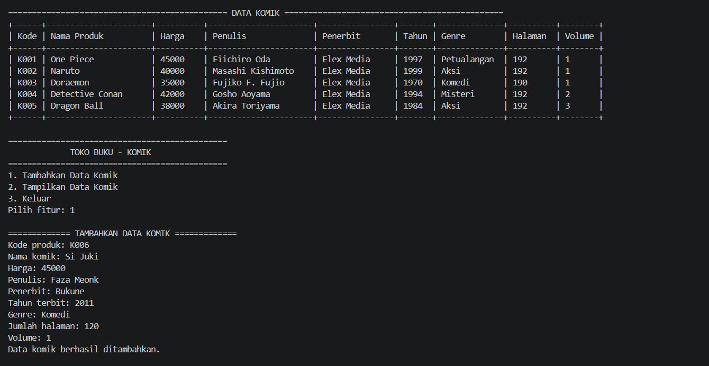

## Janji

Saya Raffi Akbar Ardiansyah dengan NIM 2511604 mengerjakan Tugas Praktikum 2 dalam mata kuliah Desain dan Pemrograman Berorientasi Objek untuk keberkahanNya maka saya tidak melakukan kecurangan seperti yang telah dispesifikasikan. Aamiin.

## Struktur File

```text
├── CPP
│   ├── Produk.cpp
│   ├── Buku.cpp
│   ├── Komik.cpp
│   ├── main.cpp
│   └── testcase.txt
│
├── Java
│   ├── Produk.java
│   ├── Buku.java
│   ├── Komik.java
│   ├── Main.java
│   └── testcase.txt
│
├── PHP
│   ├── Produk.php
│   ├── Buku.php
│   ├── Komik.php
│   ├── index.php
│   └── testcase.txt
│
├── Python
│   ├── Produk.py
│   ├── Buku.py
│   ├── Komik.py
│   ├── main.py
│   └── testcase.txt
│
├── Dokumentasi
├── diagram.jpg
└── README.md
```


## Alasan Pemilihan Class

1. Produk: Dipilih sebagai class dasar karena semua barang yang dijual di toko buku merupakan produk dan memiliki informasi umum seperti kode produk, nama produk, dan harga. Oleh karena itu, atribut tersebut dapat digunakan oleh class yang lebih spesifik melalui inheritance.

2. Buku: Dipilih sebagai turunan dari Produk karena buku merupakan salah satu jenis produk yang dijual di toko buku. Selain memiliki atribut umum dari Produk, buku membutuhkan informasi khusus seperti penulis, penerbit, dan tahun terbit.

3. Komik: Dipilih sebagai turunan dari Buku karena komik merupakan salah satu jenis buku. Komik tetap memiliki seluruh informasi dari Produk dan Buku, tetapi juga membutuhkan informasi khusus seperti genre, jumlah halaman, dan volume.


Hubungan ketiga class menggunakan Multilevel Inheritance, yaitu Produk menjadi parent dari Buku, kemudian Buku menjadi parent dari Komik.

## Class dan Atribut

Program ini menggunakan konsep **Multilevel Inheritance** dengan tiga class yang saling berhubungan, yaitu `Produk`, `Buku`, dan `Komik`. `Produk` merupakan base class, `Buku` merupakan turunan dari `Produk`, dan `Komik` merupakan turunan dari `Buku`.

### 1. `Produk` 

`Produk` merupakan class dasar yang menyimpan informasi umum dari produk yang dijual pada toko buku.

**Atribut:**

* `kodeProduk` : **string** — kode unik dari produk.
* `namaProduk` : **string** — nama produk.
* `harga` : **int** — harga produk dalam Rupiah.

### 2. `Buku`

`Buku` merupakan class turunan dari `Produk` karena buku merupakan salah satu jenis produk yang dijual di toko buku. Class ini mewarisi atribut dari `Produk` dan memiliki atribut khusus untuk menyimpan informasi buku.

**Atribut:**

* `penulis` : **string** — nama penulis buku.
* `penerbit` : **string** — nama penerbit buku.
* `tahunTerbit` : **int** — tahun diterbitkannya buku.

### 3. `Komik`

`Komik` merupakan class turunan dari `Buku` karena komik merupakan salah satu jenis buku. Class ini mewarisi atribut dari `Buku` dan `Produk`, kemudian menambahkan atribut khusus untuk menyimpan informasi komik.

**Atribut:**

* `genre` : **string** — genre komik.
* `jumlahHalaman` : **int** — jumlah halaman komik.
* `volume` : **int** — nomor volume komik.
* `foto_produk` : **string** — nama atau path gambar produk, khusus digunakan pada PHP.

---

## Alur Program

Program diawali dengan membuat **5 objek komik sebagai data awal**. Setiap objek memiliki data dari ketiga class, yaitu data umum dari `Produk`, data buku dari `Buku`, dan data khusus dari `Komik`.

Setelah data awal dibuat, program menampilkan **menu utama** yang terdiri dari tiga pilihan:

1. **Tambahkan Data Komik**
   Pengguna dapat memasukkan data komik baru berupa kode produk, nama produk, harga, penulis, penerbit, tahun terbit, genre, jumlah halaman, dan volume. Data tersebut kemudian digunakan untuk membuat objek `Komik` baru dan ditambahkan ke dalam kumpulan data yang sudah tersedia.

2. **Tampilkan Data Komik**
   Program menampilkan seluruh data komik yang tersedia, termasuk 5 data awal dan data yang telah ditambahkan pengguna. Data ditampilkan dalam satu tabel dengan kategori:

   * Kode Produk
   * Nama Produk
   * Harga
   * Penulis
   * Penerbit
   * Tahun Terbit
   * Genre
   * Jumlah Halaman
   * Volume

3. **Keluar**
   Program menghentikan proses dan keluar dari menu utama.

Secara keseluruhan, alur program adalah **Program dimulai → Membuat 5 data komik awal → Menampilkan menu → Pengguna memilih menu → Menambahkan data atau menampilkan data → Kembali ke menu → Keluar dari program**.

Program **Python, Java, dan C++** menerima input dari pengguna melalui terminal, sedangkan **PHP** menggunakan `index.php` sebagai halaman utama untuk menampilkan dan menambahkan data komik. Setiap bahasa juga memiliki `testcase.txt` yang digunakan sebagai contoh input untuk pengujian program.


## Dokumentasi

## CPP

#### Tambah Data
[](Dokumentasi/)


#### Tampilkan Data


## Java

#### Tambah Data


#### Tampilkan Data


## Python

#### Tambah Data


#### Tampilkan Data


## PHP

#### Tampilan Awal


#### Tambah Data


#### Tampilkan Data


